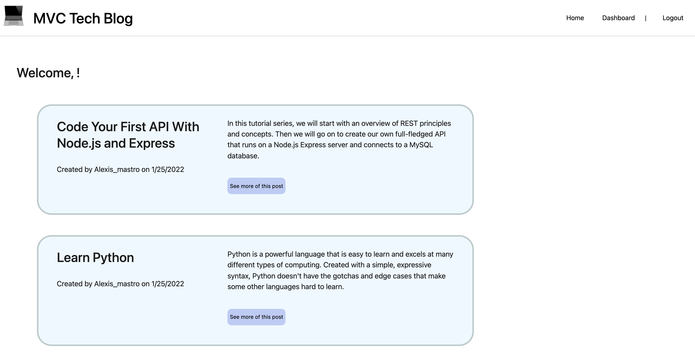

# 14 Model-View-Controller (MVC): Tech Blog

## User Story

```md
AS A developer who writes about tech
I WANT a CMS-style blog site
SO THAT I can publish articles, blog posts, and my thoughts and opinions
```

## Installation

1. Clone the repository

```bash
git clone git@github.com:LexMastro/MVC-tech-blog.git
```

2. npm install & npm start

## Problems

1. Sign up not working? Works when I run locally - not sure what I can change as everything seems fine?

## Deployed Site Link
[View Deployed Site](https://evening-dawn-70030.herokuapp.com/)

## Examples

